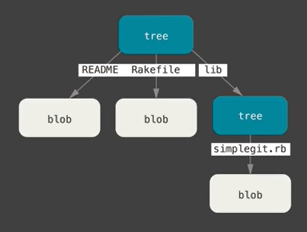
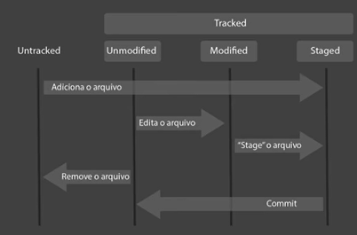

## BootCamp Santander Full-Stack

### Introdução ao Git e ao GitHub

Apesar de aparecerem juntas em varias descrições e cursos, **Git** e **GitHub** são ferramentas com proposito diferentes. O **Git** é uma ferramenta de versionamento de código (sistema de versionamento de código distribuído), ou seja ela é utilizada para controle de alterações do código, facilitando o desenvolvimento em equipe deixando claro quando, como e por quem o código foi editado. Já o **GitHub** é uma ferramenta de repositório de código online (servidor remoto para armazenamento de código), ou seja é compatível com as funções do **Git** mas proporciona armazenamento e controle remoto podendo ser utilizado por equipes descentralizadas. 

### Vantagens de utilização:

* Controle de Versão
* Armazenamento em nuvem
* Trabalho em equipe
* Melhorar seu código
* Reconhecimento

O **Git** em sua concepção usa uma **CLI** ( command line interface) logo é necessário conhecer alguns comandos para facilitar a utilização da ferramenta, mas também é possível utilizar ferramentas capazes de automatizar comandos por meio de uma **GUI** ( graphial user interface).

#### Alguns comandos uteis em CLI:

**Windows**

* **dir** (lista diretórios na pasta especificada)

* **cd** (possibilita navegação entre as pastas)

* **cls** (limpa o terminal)

* **mkdir** (Cria uma pasta)

* **echo** (repete o que você digitou)

* **del** (deleta arquivos dentro de uma pasta)

* **rmdir** (deleta a pasta)

  

  **Linux**

* **ls** (lista diretórios na pasta especificada)

* **cd** (possibilita navegação entre as pastas)

* **clear** (limpa o terminal)

* **mkdir** (Cria uma pasta)

* **echo** (repete o que você digitou)

* **rm** **-rf** (deleta tanto arquivos como diretórios o rf é utilizado para estender o comando para pastas internas sem pedir confirmação)

### Entendendo o funcionamento do Git

O **Git** é um sistema distribuído, ou seja faz com que seus objetos possuam múltiplas cópias de si mesmo em diferentes locais, os objetos estão ligados de maneira encadeada e de difícil alteração. Para esse sistema ser seguro algumas ferramentas são utilizadas.

#### Secure hash algorithm(SHA1)

É um conjunto de funções hash criptográficas projetadas pela NSA(Agência de Segurança Nacional dos EUA) e sua encriptação gera um conjunto de caracteres identificadores de 40 dígitos.

 É utilizado pelo **Git** para representar o estado do objeto, mudando  toda vez que  o ele é editado, gerando uma chave única para aquela edição, isso ajuda na identificação daquele determinado objeto.

### Objetos internos do Git

* Blobs: É a como o **Git** armazena arquivos. Ele é um objeto que armazena os metadados e o conteúdo de arquivos 
* Tree: As arvores armazenam os Blobs. Elas apontam para os blobs que tem o SHA1 e o nome do arquivo. Ela é responsável por montar a estrutura dos arquivos, apontando para blobs e outras arvores.

* Commit: É o objeto responsável por organizar e reunir todas as informações dos objetos, nele existem informações da arvore, das alterações anteriores (parent), do autor e permite identificar a alteração por uma mensagem e associa com uma timeline (timestamp) das alterações.

### Primeiros comandos com Git

* **git init** 

Inicializa um repositório, cria no caminho especificado a estrutura necessária para o **Git** funcionar

* **git config --global user.email **"_email do usuário_"
* **git config --global user.name **_nome do usuário_

Esses comandos associam as alterações efetuadas nos arquivos a um autor. Essa configuração é obrigatória 

* **git add ***

Adiciona arquivos a área de Staged (Área de arquivos que já são rastreados) e que serão preparados para o commit. A flag * adiciona todas as modificações encontradas na area de Stage

* **git commit -m** "_mensagem para explicar o commit_"

Organiza todos os arquivos e adiciona ao repositório final com a mensagem escolhida pelo usuário.

* **git status** 

Monitora o estado no arquivo, unmodified, untracked, staged.

* **git remote add origin** _link do seu repositorio no github_

  Aponta o endereço do repositório remoto

  

* **git remote -v** 

  lista os repositórios remotos que você já tem.

  

* **git push origin master** 

Envia o repositório local para o remoto.

* **git pull origin master**

Traz os arquivos com mudança para que você possa editar e enviar para o repositório novamente

* **git config --list**

Mostra as configurações gerais do git no servidor local

* **git clone** _url do repositório que você quer copiar_

Esse comando copia um repositório com todas as informações e conteúdo. Faz um clone do repositório remoto em seu repositório local.

